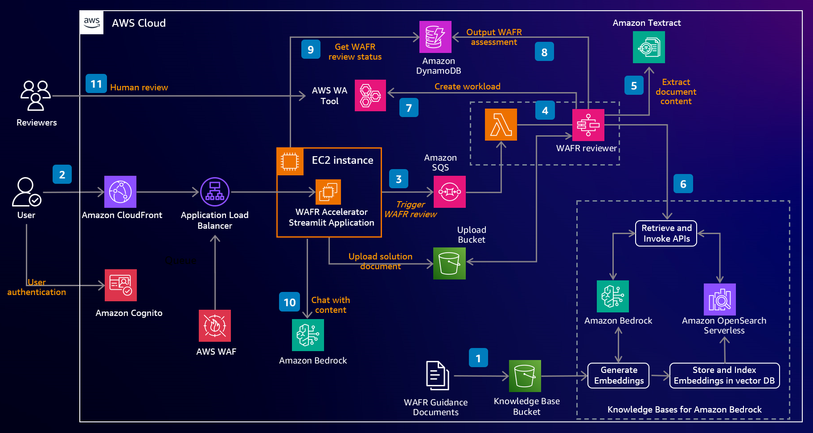
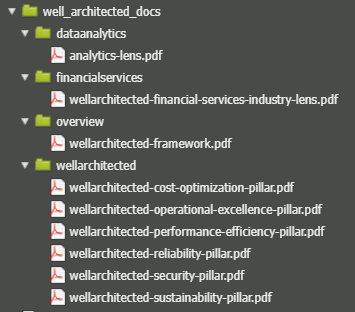
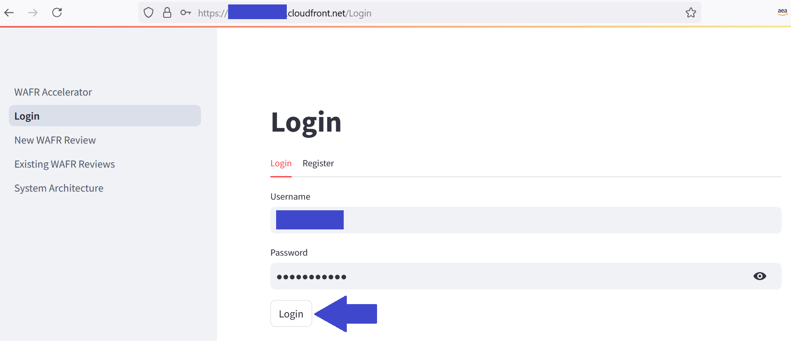
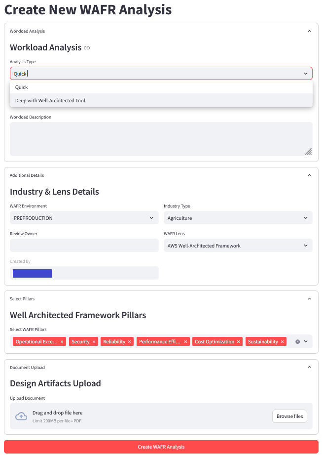
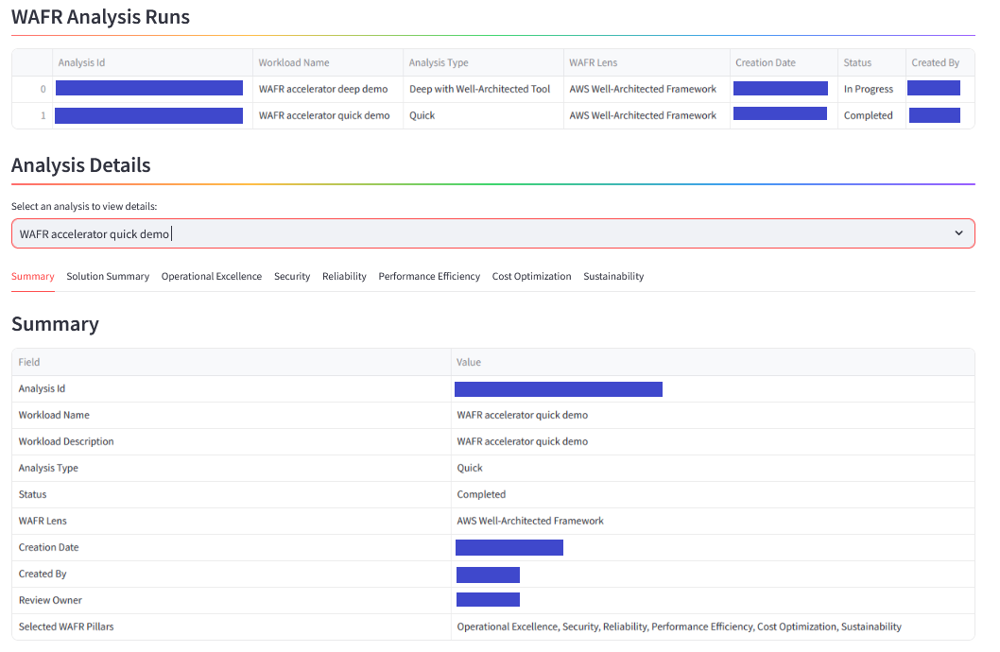

# Sample AWS Well-Architected Review (WAFR) Acceleration with Generative AI (GenAI)

## Name

AWS Well-Architected Framework Review (WAFR) Acceleration with Generative AI (GenAI)
<br/> 
## Description

This is a comprehensive sample designed to facilitate and expedite the AWS Well-Architected Framework Review process. 
<br/> 

This sample aims to accelerate AWS Well-Architected Framework Review (WAFR) velocity and adoption by leveraging the power of generative AI to provide organizations with automated comprehensive analysis and recommendations for optimizing their AWS architectures.
<br/> 

## Core Features

<br/>

* Ability to upload technical content (for example solution design and architecture documents) to be reviewed in PDF format<br/> 
* Creation of architecture assessment including:
	* Solution summary
	* Assessment
	* Well-Architected best practices
	* Recommendations for improvements
	* Risk
	* Ability to chat with the document as well as generated content
* Creation of Well-Architected workload in Well-Architected tool that has:
	* Initial selection of choices for each of the question based on the assessment.
	* Notes populated with the generated assessment.

## Technical Architecture

 <br/> 

## Implementation Guide

### Pre-requisites
* Ensure you have access to the following models in Amazon Bedrock:
	* Titan Embeddings G1 - Text
	* Claude 3-5 Sonnet

### Cloning Repository

Clone the repository to your local directory. You can use the following command:<br/> 
```
git clone https://github.com/aws-samples/sample-well-architected-acceleration-with-generative-ai.git
```
Alternatively, you can download the code as a zip file.

### Code Download

Download the compressed source code. You can do this by selecting the ‘Code’ drop down menu on top right side.<br/> 
If you downloaded the .zip file, you can use the following command:<br/> 

```
unzip sample-well-architected-acceleration-with-generative-ai-main.zip
```
```
cd sample-well-architected-acceleration-with-generative-ai-main/
```

### Preparing and populating Amazon Bedrock Knowledge Base with AWS Well-Architected Reference Documents

Amazon Bedrock knowledge base is driven by the AWS Well-Architected documents. Download the documents in the PDF format and put them under 'well_architected_docs' folder. These should be populated before the build for them to be ingested during the build. Delete the default README.MD from the 'well_architected_docs' folder. 
 <br/>  <br/> 
 <br/> 
 <br/> 

**AWS Well-Architected Framework Overview:** (place it under 'well_architected_docs/overview' subfolder)
 <br/> 

 * [Overview](https://docs.aws.amazon.com/wellarchitected/latest/framework/welcome.html)

**AWS Well-Architected Framework pillar documents:** (place them under 'well_architected_docs/wellarchitected' subfolder)
 <br/> 
 
 * [Operational Excellence](https://docs.aws.amazon.com/wellarchitected/latest/operational-excellence-pillar/welcome.html)
 
 * [Security](https://docs.aws.amazon.com/wellarchitected/latest/security-pillar/welcome.html)
 
 * [Reliability](https://docs.aws.amazon.com/wellarchitected/latest/reliability-pillar/welcome.html)
 
 * [Performance efficiency](https://docs.aws.amazon.com/wellarchitected/latest/performance-efficiency-pillar/welcome.html)
 
 * [Cost optimization](https://docs.aws.amazon.com/wellarchitected/latest/cost-optimization-pillar/welcome.html)
 
 * [Sustainability](https://docs.aws.amazon.com/wellarchitected/latest/sustainability-pillar/sustainability-pillar.html)

Repeat the above for:<br/>
 
 **[Financial Services Industry Lens:](https://docs.aws.amazon.com/wellarchitected/latest/financial-services-industry-lens/financial-services-industry-lens.html)** Place it under 'well_architected_docs/financialservices' subfolder. 

 **[Data Analytics Lens:](https://docs.aws.amazon.com/wellarchitected/latest/analytics-lens/analytics-lens.html)**  Place it under 'well_architected_docs/dataanalytics' subfolder.  

The 'well_architected_docs' folder would now look like as below:<br/> <br/> 
<br/>  

* Note: At present, only the above Well-Architected lenses are supported.

* Note: If you missed this step or would like to refresh the documents with further releases of Well-Architected Framework then:
	* Upload the files to the knowledge base bucket created by the stack, adhering to the above folder structure. 
	* On AWS management console, go to Amazon Bedrock -> Knowledge bases -> Click on the knowledge base created by the stack-> Data Source -> Sync. This will re-sync the knowledge base from the S3 bucket. <br/> 

### CDK Deployment 

Manually create a virtualenv on MacOS and Linux:

```
python3 -m venv .venv
```

After the init process completes and the virtualenv is created, you can use the following
step to activate your virtualenv.

```
source .venv/bin/activate
```

If you are a Windows platform, you would activate the virtualenv like this:

```
% .venv\Scripts\activate.bat
```

Once the virtualenv is activated, you can install the required dependencies.

```
pip3 install -r requirements.txt
```    

Open "wafr_genai_accelerator/wafr_genai_accelerator_stack.py" file using a file editor such as nano and update the Cloundfront [managed prefix list](https://docs.aws.amazon.com/AmazonCloudFront/latest/DeveloperGuide/LocationsOfEdgeServers.html) for your deployment region. As a default, it uses 'us-west-2' managed prefix list.


```
alb_security_group.add_ingress_rule(
	ec2.Peer.prefix_list("pl-82a045eb"),
	ec2.Port.HTTP, 
	"Allow inbound connections only from Cloudfront to Streamlit port"
)
```

Open app.py, update and uncomment either of the following lines based on your deployment location:

```
#env=cdk.Environment(account=os.getenv('CDK_DEFAULT_ACCOUNT'), region=os.getenv('CDK_DEFAULT_REGION')),
```
Or
```
#env=cdk.Environment(account='111122223333', region='us-west-2'),
```

If you are deploying CDK for the first time in your account, run the below command (if not, skip this step):

```
cdk bootstrap
```

At this point you can now synthesize the CloudFormation template for this code.

```
cdk synth
```

You can now deploy the CDK stack:

```
cdk deploy
```

You will need to enter 'y' to confirm the deployment. The deployment can take around 20-25 minutes to complete. 
<br/> 

### Demo configurations

On the cdk build completion, you would see three outputs:<br/>
	a) Amazon Cognito user pool name <br/> 
	b) Front end UI EC2 instance id <br/> 
    c) Amazon Cloudfront URL for the web application 
<br/> 

##### Add a user to Amazon Cognito user pool

Firstly, [add a user to the Amazon Cognito pool](https://docs.aws.amazon.com/cognito/latest/developerguide/how-to-create-user-accounts.html#creating-a-new-user-using-the-console) indicated in the output. You would use this user credentials for application login later on. 

##### EC2 sanity check

Next, login to the EC2 the instance as ec2-user (for example using EC2 Instance Connect) and check if the front end user interface folder has been synced. 

```
cd /wafr-accelerator
ls -l 
```

If there is no "pages" folder then sync the front end user interface as below.

```
python3 syncUIFolder.py
```

Ensure /wafr-accelerator and all the files underneath are owned by ec2-user. If not then execute the following.

```
sudo chown -R ec2-user:ec2-user /wafr-accelerator
```

##### Running the application

Once the UI folder has been synced, run the application as below

```
streamlit run WAFR_Accelerator.py
``` 

You can now use the Amazon Cloudfront URL from the CDK output to access the sample application in a web browser.
<br/> 

### Testing the demo application

Open a new web browser window and copy the Amazon Cloudfront URL copied earlier into the address bar. On the login page, enter the user credentials for the previously created user.<br/>
<br/> 
<br/> 
<br/> 
On home page, click on the "New WAFR Review" link.
<br/> <br/>
<br/> 
<br/> 
On "Create New WAFR Analysis" page, select the analysis type ("Quick" or "Deep with Well-Architected Tool") and provide analysis name, description, Well Architectd lens, etc. in the input form. <br/>
<br/> 
**Analysis Types**:<br/>
* **"Quick"** - quick analysis without the creation of workload in the AWS Well-Architected tool. Relatively faster as it groups all questions for an individual pillar into a single prompt; suitable for initial assessment. 
* **"Deep with Well-Architected Tool"** - robust and deep analysis that also creates workload in the AWS Well-Architected tool. Takes longer to complete as it doesn't group questions and responses are generated for every question individually. This takes longer to execute. 



* Note: "Created by" field is automatically populated with the logged user name.
  
You have an option to select one or more Well-Architected pillars. <br/><br/>Finally upload the solution architecture / technical design document that needs to be analysed and press the "Create WAFR Analysis" button.<br/> 
<br/> 
Post successful submission, navigate to the "Existing WAFR Reviews" page. The newly submitted analysis would be listed in the table along with any existing reviews. <br/> <br/> 
<br/> 

Once the analysis is marked "Completed", the WAFR analysis for the selected lens would be shown at the bottom part of the page. If there are multiple reviews, then select the relevant analysis from the combo list. 
<br/>

<br/> 

* Note: Analysis duration varies based on the Analysis Type ("Quick" or "Deep with Well-Architected Tool") and number of WAFR Pillars selected. A 'Quick' analysis type with one WAFR pillar is likely to be much quicker than "Deep with Well-Architected Tool" analysis type with all the six WAFR Pillars selected.<br/> 
* Note: Only the questions for the selected Well-Architected lens and pillars are answered. <br/>

To chat with the uploaded document as well as any of the generated content by using the "WAFR Chat" section at the bottom of the "Existing WAFR Reviews" page.
<br/>

<br/> 
<br/> 

### Uninstall - CDK Undeploy 

If you no longer need the application or would like to delete the CDK deployment, run the following command:

```
cdk destroy
```

### Additional considerations
Please see [Additional Considerations](Additional%20Considerations.md)


### Disclaimer
This is a sample code, for non-production usage. You should work with your security and legal teams to meet your organizational security, regulatory and compliance requirements before deployment.

